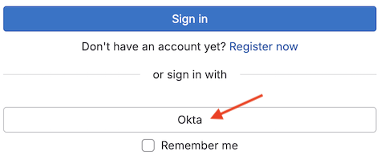

For Group SAML steps, follow [SAML](saml.md)

This document illustrates how to set up a SAML application in KDK using Okta as the identity provider. 

## In Okta

1. [Sign up for a free Okta developer account](https://developer.okta.com/signup/). Make sure your VPN is **OFF**, otherwise you'll likely encounter issues during signup.
1. After you succcessfully sign up, you should receive an account verification email from Okta. The email should contain a link to sign into Okta, such as `hxxps://dev-\12345678.okta.com`. If you are prompted to configure Okta Verify multifactor authentication, follow the steps to complete it.
1. After you sign into Okta, go to **Applications > Create Application Integration > SAML 2.0**. On the **Create SAML Integration** page, complete the following fields:

   - For **App name**, fill in what make sense to you.
   - In the **SAML settings** section, enter the following values:
     - **Single Sign On URL**: `<KDK_URL>/users/auth/saml/callback`
     - **Audience URI (SP Entity ID)**: `<KDK_URL>`
     - **Name ID format**: Select **Persistent**
     - **Application username**: Select **Oktausername**
1. After you create the SAML application in Okta:
   1. Select the SAML application.
   1. Navigate to the **Sign On** tab.
   1. Select **More details**. Copy the **Sign on URL** and **SHA1 (formatted)** to use later.
1. Depending on your use case, you might need to create user accounts. To create a user account, go to **Directory > People > Add person**, and enter the person's details. After you add the person, they should receive an email from Okta verifying their account. Make sure they verify their account. They also might need to set up Okta Verify. After verification, their status should be **Active**. *Note*: make sure this user also exists in the KDK instance.
1. To assign the person to the SAML application, find the application and go to **Assignments > Assign > Assign to People**. Choose the person you want to add and select **Assign**. 

## In KDK

1. Go to `/path/to/kdk` and open the `khulnasoft/config/khulnasoft.yml` file. Add the following under `development:`

   ```yaml
   development:
     <<: *base
     omniauth:
       enabled: true
       allow_single_sign_on: ["saml"]
       block_auto_created_users: false
       auto_link_saml_user: true
       providers:
       - {
           name: 'saml',
           label: 'Okta', 
           args: {
             assertion_consumer_service_url: '<KDK_URL>/users/auth/saml/callback',
             idp_cert_fingerprint: '<COPIED_SHA1_FROM_OKTA>',
             idp_sso_target_url: 'https://dev-12345678.okta.com/app/dev-12345678_xxxxxxx_1/xxxxxxxxxxxx/sso/saml',
             issuer: 'KDK_URL',
             name_identifier_format: 'urn:oasis:names:tc:SAML:2.0:nameid-format:persistent'
           }
         }
   ```

1. Run `kdk restart`.
1. Now your KDK should have the Okta sign in option:
   
1. Sign in to KDK using the user account you created in the preceding step. Select the user account's profile and go to **Edit Profile > Account > Service sign-in** and connect to Okta. Under **Connected accounts** you should now see **Okta Active**. If the user account isn't verified as described earlier in this guide, the status will be **Connect Okta**. If this is the case, validate the user account.
1. Sign out and sign in with Okta. Single-sign on should now work.
